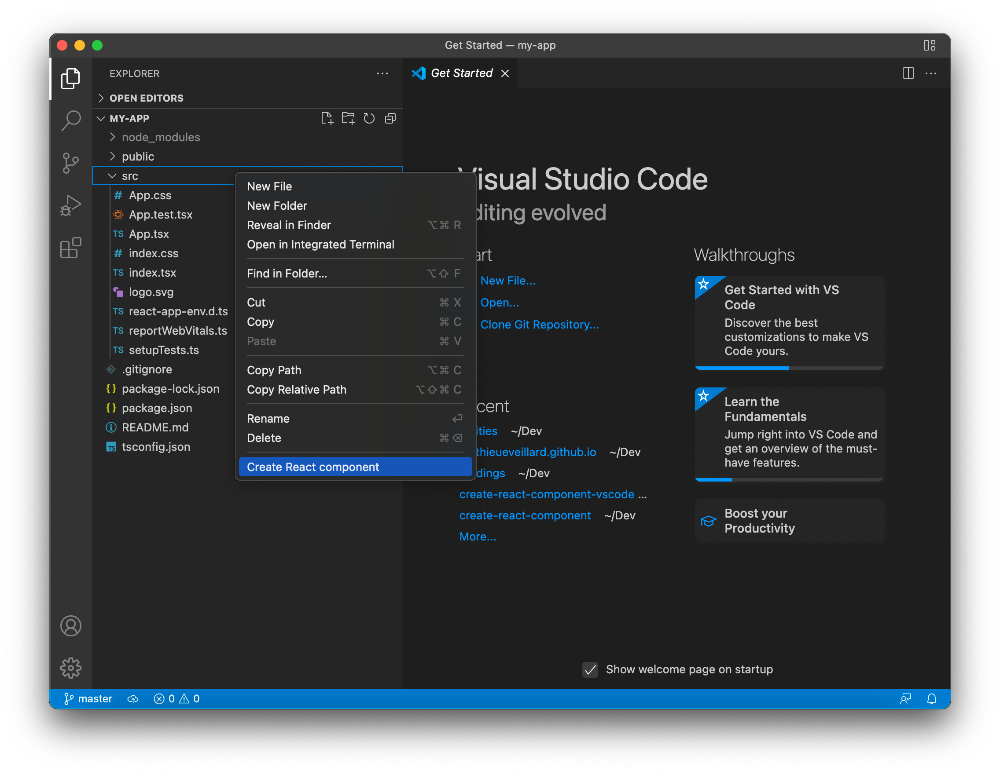
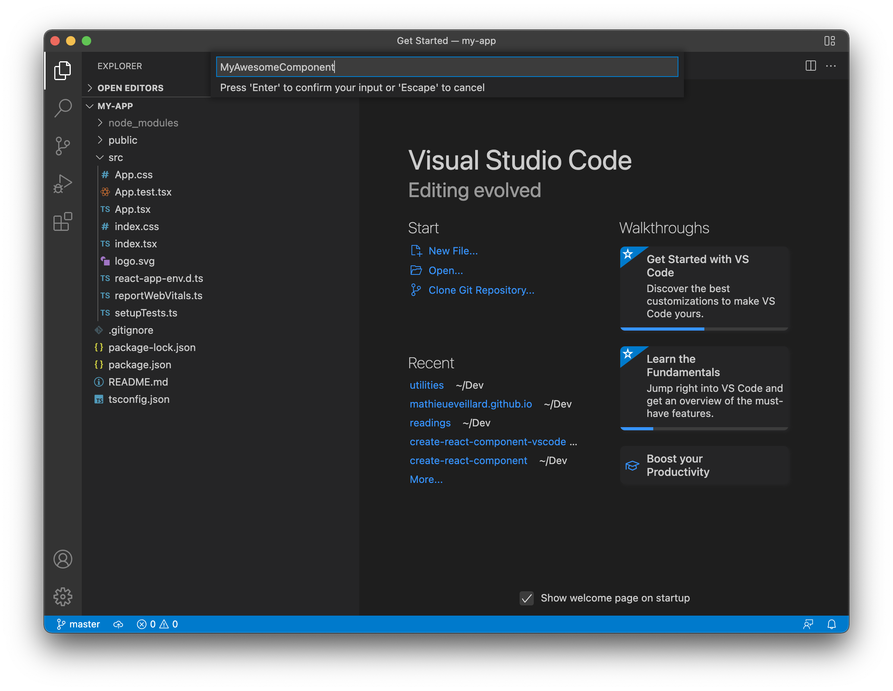
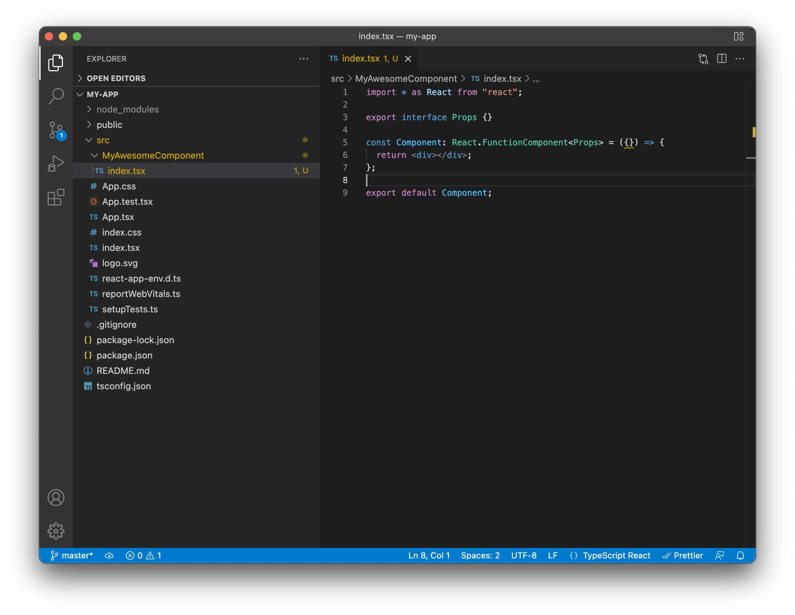

# create-react-component

## Features

One single command, accessed via contextual menu:

Input the component's name:

And you're done!

## Development and installation process

This extension is not meant to be published. Instead, you'll want to:

1. Fork this repository
2. Make your own modifications (`npm run compile:watch`, then `F5`)
3. Package the extension (`npm run package`) and install the resulting `.vsix` file on your computer (Extensions > ... > Install from VSIX)

## Additional resources

- https://code.visualstudio.com/api/working-with-extensions/publishing-extension#vsce
- https://code.visualstudio.com/api/working-with-extensions/bundling-extension#using-esbuild
